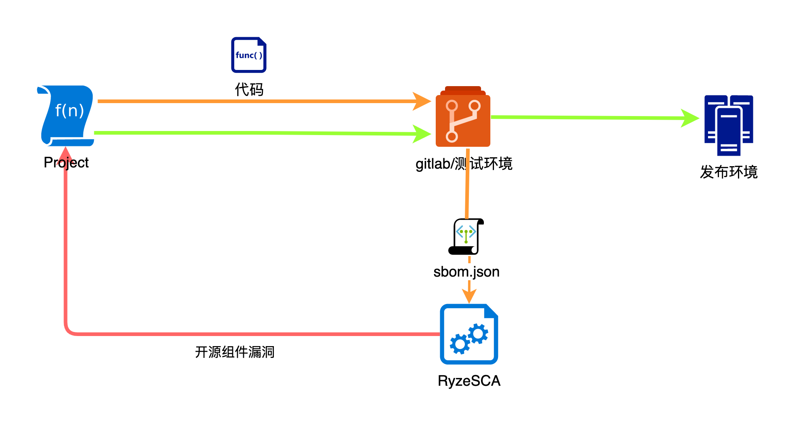
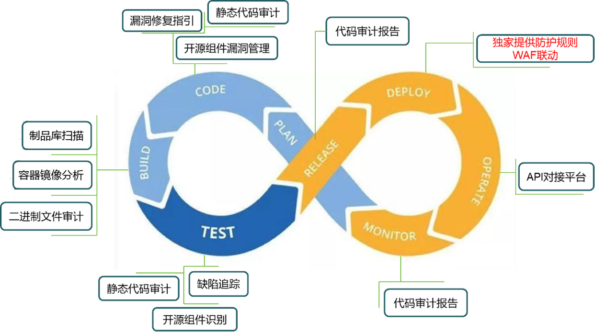
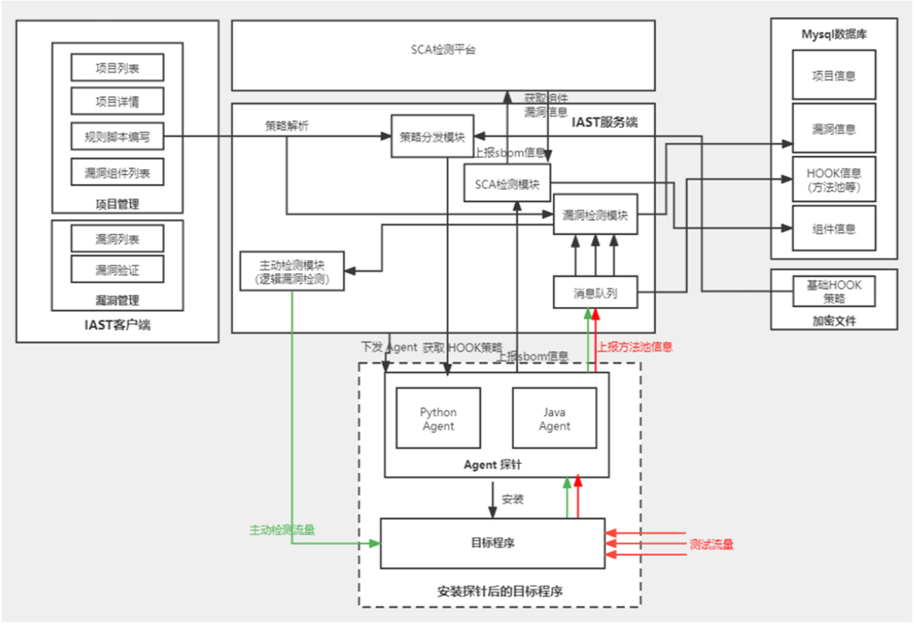

# RyzeSCA
在软件的开发生命周期中，漏洞的引入不止有开发人员编写的代码，还有所依赖的开源组件、开发和构建工具等。出于对开发成本的考虑，在项目中广泛使用开源组件已成为主流的方式。开源组件包括开发框架及功能组件等，在系统开发过程中，应严格控制引入的开源组件风险，将已知漏洞摒除于软件交付运行之前。
RyzeSCA（软件成分分析）可提供DevSecOps解决方案中的开源组件漏洞分析能力。在代码构建时引入RyzeSCA，可以有效把控项目的第三方组件，提升整体安全质量。

## 使用说明
### 数据源接入
RyzeSCA基于数十万的开源组件漏洞库，提供漏洞检测能力。由于数据量大，需要部署使用的用户，可发送邮件至 msec@nsfocus.com 获取数据，会有相关人员跟您联系。
考虑到服务运行稳定性，建议将数据导入至MySQL数据库。

### RyzeSCA使用
RyzeSCA开放grpc接口，您可以按照数据格式要求，调用RyzeSCA相关功能。
RyzeSCA入参为CycloneDX标准格式的sbom数据，根据提供的sbom依赖组件数据，RyzeSCA将输出和反馈组件的漏洞信息，输入的样例格式如下所示：

```json
{
	"$schema": "http://cyclonedx.org/schema/bom-1.4.schema.json",
	"bomFormat": "CycloneDX",
	"components": [{
				"bom-ref": "pkg:pypi/setuptools@18.1",
				"name": "setuptools",
				"purl": "pkg:pypi/setuptools@18.1",
				"type": "library",
				"version": "18.1"
			}, {
				"bom-ref": "pkg:pypi/celery@3.1.19",
				"name": "celery",
				"purl": "pkg:pypi/celery@3.1.19",
				"type": "library",
				"version": "3.1.19"
			}, {
				"bom-ref": "pkg:pypi/kombu@3.0.37",
				"name": "kombu",
				"purl": "pkg:pypi/kombu@3.0.37",
				"type": "library",
				"version": "3.0.37"
			}],
    "metadata":{"timestamp":"2022-08-12T08:03:30.459054+00:00", "tools":{"name":"SDA", "vendor":"", "version":""}},
    "serialNumber":"urn:uuid:bf6ceb1f-3cfc-4475-be23-656ac8b34002",
    "specVersion":"1.4",
    "version":1,
    "vulnerabilities":[]
```

RyzeSCA根据提供的sbom数据，返回输出组件的漏洞相关信息，数据格式，您可以参考golang的结构数据：

```go

type PackageVulerability struct {
	state         protoimpl.MessageState
	sizeCache     protoimpl.SizeCache
	unknownFields protoimpl.UnknownFields

	PackageName           string    `json:"package_name,omitempty"`			//组件名称
	PackageVersion        string    `json:"package_version,omitempty"`		//组件版本
	Purl                  string   											// url
	PackageIdentifiers    []string `json:"package_identifiers,omitempty"`
	VulnerableIdentifiers []string `json:"vulnerable_identifiers,omitempty"`
	VulnerableVersions    []string `json:"vulnerable_versions,omitempty"`
	RiskLevel             int32    `json:"risk_level,omitempty"`			//风险等级
	// TODO 对应cve_infos 数据库
	CveVulInfos []*CVEInfo 			`json:"cve_vul_infos,omitempty"`
}

type CVEInfo struct {
	state         protoimpl.MessageState
	sizeCache     protoimpl.SizeCache
	unknownFields protoimpl.UnknownFields

	// TODO 对应cve_infos 数据库
	NssvdId          string                     `json:"nssvd_id,omitempty"`
	CveId            string                     `json:"cve_id,omitempty"`		// cve_id
	CnnvdId          string                     `json:"cnnvd_id,omitempty"`		// cnnvd_id
	CnnvdName        string                     `json:"cnnvd_name,omitempty"`	// 漏洞名称
	CnvdId           string                     `json:"cnvd_id,omitempty"`
	CnvdName         string                     `json:"cnvd_name,omitempty"`	// 漏洞名称
	DescriptionEn    string                     `json:"description_en,omitempty"`	//漏洞描述（英文）
	DescriptionZh    string                     `json:"description_zh,omitempty"`	//漏洞描述（中文）
	SolutionEn       string                     `json:"solution_en,omitempty"`		//修复建议（英文）
	SolutionZh       string                     `json:"solution_zh,omitempty"`		//修复建议（英文）
	PublishedDate    string                     `json:"published_date,omitempty"`
	LastModifiedDate string                     `json:"last_modified_date,omitempty"`
	CweIds           *CVEInfo_CWE               `json:"cwe_ids,omitempty"`
	Identifier       string                     `json:"identifier,omitempty"`
	Version          string                     `json:"version,omitempty"`
	Confidence       string                     `json:"confidence,omitempty"`
	CveReferences    []*CVEInfo_CVEReference    `json:"cve_references,omitempty"`
}
```


### RyzeSCA使用场景
RyzeSCA支持CloneDX格式的sbom，您可以使用CycloneDX for Maven/Gradle、CycloneDX for Go、CycloneDX for Rust Cargo、CycloneDX for Python等工具，引入CI/CD项目中，提取sbom数据交由RyzeSCA进行安全分析，如下图。
 

## 绿盟科技相关商业产品
经绿盟专业安全研发团队出品的工具，面向M-SEC社区开放，为广大安全从业者提供相关能力支持，除社区工具外，绿盟科技也提供相关能力安全产品，您也可以邮件 msec@nsfocus.com 申请绿盟科技商业产品。
### SDA（绿盟安全开发与分析系统）
绿盟代码安全审计系统（Software Detect Analysis, SDA）是一款企业级的代码安全审计系统。产品定位于在软件开发环节发现代码级缺陷的产品。不同于传统的代码审计，SDA既支持以单独的工具形式使用，但我们更推崇的是将此工具集成到软件生命周期（SDL）的tool chain中，满足系统快速上线，满足等保合规要求。
SDA是一款集软件组成分析（SCA）和静态应用程序安全测试（SAST）能力的，提供一套完整的开源组件资产识别、开源组件漏洞识别、源代码缺陷审计的解决方案。在不改变企业现有开发测试流程的前提下，与软件版本管理、缺陷追踪等系统进行集成，实现代码安全目标的统一管理、漏洞修复指引、安全审计报告、组成分析清单等功能。
系统核心的特性是将SCA和SAST两大功能融合在了一起，能够在DevOps的开发流程中, 提供不同的切入点,实现和代码相关的安全评估和审计。具体的切入点, 如下图所示：


### RyzeIAST（绿盟交互式应用安全测试系统）
RyzeIAST集成了IAST和SCA方面的能力，通过Server-Agent的交互方式，实现对软件的安全检测。其中RyzeIAST的Agent探针依附软件运行的中间件，用于在系统运行过程中采集交互信息，可以动态加载的第三方组件及依赖，因此RyzeIAST对于sbom的自动化构建及安全检测方面具备先天的优势。


@author buding00：M-SEC社区核心认证成员，社区共创勋章获得者，深入理解漏洞原理，擅长代码审计及漏洞挖掘，擅长golang和python等语言的系统开发，RyzeSCA是其代表项目之一。
RyzeSCA将由buding00和M-SEC社区官方人员共同维护，也期待各位的反馈和建议。